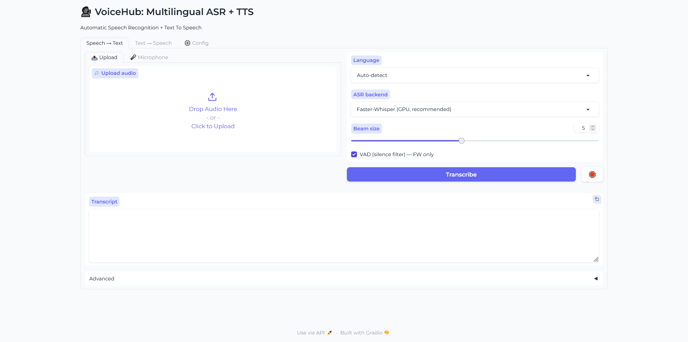
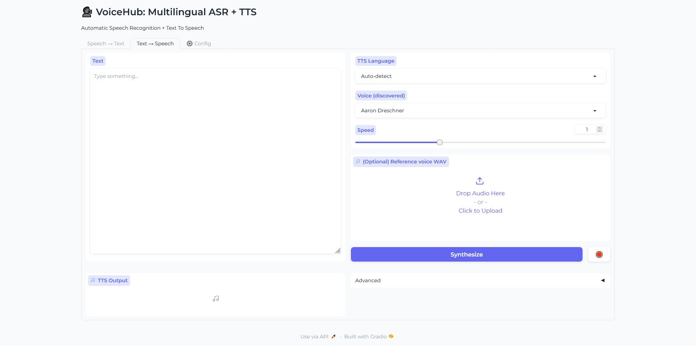
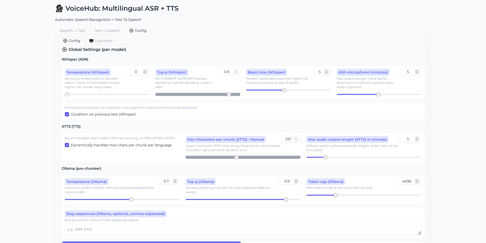
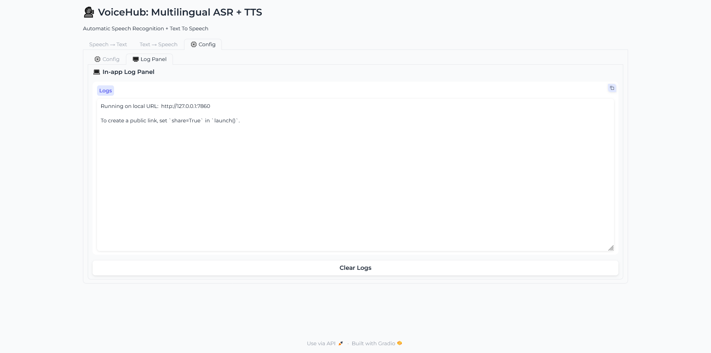

# VoiceHub 0.2.0 — Multilingual ASR + TTS (Gradio)

  

VoiceHub is a local-first speech toolkit that combines **Automatic Speech Recognition (ASR)** and **Text-to-Speech (TTS)** in a clean Gradio app. It supports **file uploads** and **live microphone streaming**, **console-style progress readouts**, an **in-app Log Panel**, and optional **Ollama** integration to pre-chunk and punctuate text for smoother TTS.

  

### What's new?

Version **0.2.0** keeps **XTTS** as the safe default TTS family, upgrades ASR to **faster-whisper + whisper-large-v3-turbo**, and adds **Qwen3-TTS 1.7B / 0.6B** as optional backends with automatic fallback to XTTS when Qwen-TTS is unavailable or the detected language is not supported.

  

I kept version **0.1.5** saved in another branch if you prefer falling back to the previous version.

  

---

  

## Table of contents

  

- [Highlights in 0.2.0](#highlights-in-020)

- [Features](#features)

- [Requirements](#requirements)

- [Install](#install)

- [Choose your PyTorch (GPU or CPU)](#choose-your-pytorch-gpu-or-cpu)

- [Run](#run)

- [Runtime configuration](#runtime-configuration)

- [How it works](#how-it-works)

- [Configuration & preferences](#configuration--preferences)

- [ASR](#asr)

- [TTS](#tts)

- [Ollama (optional)](#ollama-optional)

- [Logs & debugging](#logs--debugging)

- [Project layout](#project-layout)

- [Environment variables](#environment-variables)

- [Troubleshooting](#troubleshooting)

- [Roadmap / limitations](#roadmap--limitations)

- [Screenshots](#screenshots)

- [Sample audio](#sample-audio)

- [License](#license)

- [Quick start (TL;DR)](#quick-start-tldr)

  

---

  

## Highlights in 0.2.0

  

-  **ASR default upgraded** to **faster-whisper + turbo**.

-  **Two TTS families**:

	-  **XTTS-v2** as the default and fallback backend.

	- **Qwen3-TTS** as an optional TTS backend.

	-  **Qwen3-TTS 1.7B / 0.6B** support.

-  **Voice clone cache for Qwen**:

	- ASR transcript is generated from the uploaded reference audio.

	- transcript is saved as `.txt`.

	- metadata is saved as `.json`.

	- repeated use of the same reference audio reuses the cached transcript.

-  **Backend-aware voice dropdown** such as `Ryan (Qwen)` and `Aaron Dreschner (XTTS)`.

-  **Model-aware chunking**:

	- XTTS keeps strict conservative chunking.

	- Qwen uses softer chunking.

-  **Lazy loading**:

	- Qwen is **not** loaded or downloaded until you select Qwen.

-  **Personal note:** I still think XTTS is the better choice if you want speed. Qwen-TTS can sound better in some cases, but it is considerably slower. Depending on your application, XTTS might be more than enough and much faster.

  

## Features

  

Features from VoiceHub **0.1.5** and **0.2.0**.

  

-  **Two-way speech pipeline**.

-  **Speech → Text (ASR)** via **faster-whisper** (GPU/CPU) with VAD and streaming mic capture; **OpenAI Whisper** is still available as an alternative backend.

-  **Text → Speech (TTS)** via **Coqui XTTS-v2** with speaker discovery, speed control, optional reference-voice cloning, and optional **Qwen3-TTS** backends.

-  **Preferences stored in a normal JSON config file** with migration from the older `~/.voicehub/config.json` layout.

-  **Config tab** for per-model defaults (ASR, TTS, Ollama) with Save and Reset to recommended defaults.

-  **Log Panel** tab that mirrors stdout/stderr into an in-app textbox.

-  **Console-style progress bars** (single-line, printed to the log/prompt). I avoid multiple Gradio progress widgets to keep the UI clean.

-  **Optional Ollama integration**:

-  **Pre-chunker for TTS**: refine punctuation and split long text into TTS-friendly segments.

-  **Translator for ASR**: translate recognized text into another language directly from the ASR tab.

- UI to refresh models, test connectivity, and **Set as default model**. Public fallback model is **`gemma3:12b`**, and you can persist a different choice.

  

---

  

## Requirements

  

-  **A fresh Python environment is strongly recommended** for 0.2.0.

-  **Recommended Python:**  **3.12** for VoiceHub 0.2.0.

-  **GPU is optional**, but strongly recommended for a smoother experience.

- VoiceHub 0.2.0 now has split requirement files so Qwen stays optional:

-  `requirements.txt` → lightweight / XTTS-first install.

-  `requirements_xtts.txt` → XTTS-only install.

-  `requirements_full.txt` → XTTS + optional Qwen install.

- Keep version 0.1.5 in a **separate branch / separate environment** if you want a safe fallback path.

  

---

  

## Install

  

>  `requirements*.txt` intentionally do **not** include PyTorch. Install PyTorch first (GPU or CPU), then install the rest of the dependencies.

  

### 1) Create a fresh environment

  

**Conda (recommended)**

  

```bash

# from repository root

conda  create  --name  voicehub_020  python=3.12  -y

conda  activate  voicehub_020

```

  

**OR: venv (pip)**

  

```bash

python  -m  venv  .venv

# Windows: .venv\Scripts\activate

source  .venv/bin/activate

```

  

### 2) Optional: FlashAttention (Qwen + CUDA only)

  

On Windows, my own workflow to make this project work with faster Qwen inference was:

  

- install a prebuilt FlashAttention wheel from the community Windows wheel page:

- <https://huggingface.co/ussoewwin/Flash-Attention-2_for_Windows>

- then install the wheel locally, for example:

  

```bash

pip  install  flash_attn-2.8.2%2Bcu129torch2.8.0cxx11abiTRUE-cp312-cp312-win_amd64.whl

```

  

Otherwise, the usual direct attempt is:

  

```bash

pip  install  flash-attn  --no-build-isolation

```

  

This is **optional** and only relevant if you want Qwen-TTS to run faster. XTTS does not need it.

  

### 3) Choose your PyTorch (GPU or CPU)

  

#### GPU (CUDA 12.8) (tested)

  

```bash

pip  install  torch==2.9.1  torchvision==0.24.1  torchaudio==2.9.1  --index-url  https://download.pytorch.org/whl/cu128

```

  

#### GPU (CUDA 12.6)

  

```bash

pip  install  torch==2.9.1  torchvision==0.24.1  torchaudio==2.9.1  --index-url  https://download.pytorch.org/whl/cu126

```

  

#### CPU

  

```bash

pip  install  --index-url  https://download.pytorch.org/whl/cpu  torch==2.9.1  torchvision==0.24.1  torchaudio==2.9.1

```

  

**Notes**

  

- A CUDA-capable GPU is recommended for a smoother experience.

- CPU mode should work, but it will be much slower.

-  **Apple Silicon (M1/M2/M3)**: use the CPU wheels — PyTorch will use Metal (MPS) automatically.

- If you already installed a different Torch build in your env, these commands will reinstall the specified version.

  

**Quick check**

  

```bash

python  - << 'PY'

import torch

print("torch:", torch.__version__, "cuda:", torch.cuda.is_available())

PY

```

  

### 4) Install the remaining dependencies

  

Here you have two main options: XTTS only, or XTTS + Qwen.

  

**XTTS-focused install**

  

```bash

pip  install  -r  requirements_xtts.txt

```

  

**Full install with optional Qwen**

  

```bash

pip  install  -r  requirements_full.txt

```

  

`requirements.txt` is also kept as a lightweight XTTS-first install if you want the simpler default path.

  

### 5) Optional system tools for Qwen / audio

  

Qwen may require **SoX** to be available on your system PATH.

  

For audio conversion utilities, install **ffmpeg**. A simple option is:

  

```bash

conda  install  -c  conda-forge  ffmpeg

conda  install  -c  conda-forge  sox

```

  

---

  

## Run

  

Either use `python app.py` or `run.sh` / `run.bat`.

  

```bash

python  app.py

```

  

```bash

# windows

run.bat

  

# linux

run.sh

```

  

By default the app binds to `127.0.0.1:7870`. You can override with:

  

```bash

SERVER_NAME=127.0.0.1  SERVER_PORT=7860  python  app.py

```

  

---

  

## Runtime configuration

  

VoiceHub can be customized at launch via **environment variables**.

  

Set them temporarily in your shell, or permanently in your `run.sh` / `run.bat`.

  

### Core server settings

  

-  `SERVER_NAME` – interface to bind the Gradio app. Default: `127.0.0.1`

- set to `0.0.0.0` for LAN access.

-  `SERVER_PORT` – port number. Default: `7870`

-  `MAX_FILE_SIZE` – max file upload size. Default: `300mb`

  

### Preferences directory

  

-  `VOICEHUB_PREFS_DIR` – folder where preferences (for example `config.json`) are stored.

- default: `~/.voicehub/preferences/`

  

### ASR

  

-  `ASR_MODEL` — default is `turbo`

-  `ASR_INT8` — set to `1` to use `int8_float16`

-  `ASR_BACKEND` — UI still exposes faster-whisper / OpenAI Whisper choices directly

  

### XTTS

  

-  `TTS_MODEL` — override XTTS model id if needed

  

### Qwen

  

-  `QWEN_CUSTOM_MODEL` — defaults to the selected Qwen model size, for example `Qwen/Qwen3-TTS-12Hz-1.7B-CustomVoice`

-  `QWEN_CLONE_MODEL` — defaults to the selected Qwen model size, for example `Qwen/Qwen3-TTS-12Hz-1.7B-Base`

-  `QWEN_TTS_MAX_CHARS` — default shared Qwen chunk cap is `512`

-  `QWEN_MAX_NEW_TOKENS` — default internal generation guard is `1024`

  

### Ollama

  

-  `OLLAMA_ENABLE` – `1` to enable Ollama integration (default `0`)

-  `OLLAMA_MODEL` / `OLLAMA_MODEL_DEFAULT` – which Ollama model to use

-  `OLLAMA_HOST` – default `http://127.0.0.1:11434`

-  `OLLAMA_TIMEOUT` – timeout in seconds (default: `30`)

-  `OLLAMA_MAX_SEG_CHARS` – max characters per segment Ollama should return (default: `200`)

  

### How to set variables

  

**Linux / macOS (bash):**

  

```bash

SERVER_PORT=7860  OLLAMA_ENABLE=1  python  app.py

```

  

**Windows (cmd / run.bat):**

  

```bash

@echo  off

set  SERVER_PORT=7860

set  OLLAMA_ENABLE=1

python  app.py

```

  

**Windows (PowerShell):**

  

```bash

$env:SERVER_PORT=7860

$env:OLLAMA_ENABLE=1

python  app.py

```

  

---

  

## How it works

  

-  **Bootstrap** happens in `app.py`. It makes `src/` importable, queues Gradio for streaming events, increases max upload size, and mutes specific non-critical errors/warnings.

-  **UI** lives in `src/voicehub/ui.py`: builds tabs, wires buttons, and manages component state. Mic streaming uses `Audio.start_recording/stream/stop_recording`.

-  **Preferences** are JSON under the user prefs directory (default `~/.voicehub/preferences/config.json`).

-  **User settings** (beam size, XTTS/Qwen chunk caps, clone reference caps, mic hard cap, etc.) are centralized and persisted via the **Config** tab.

-  **Log Panel** tees stdout/stderr so you can glance at everything from inside the UI.

  

---

  

## Configuration & preferences

  

### Where are my settings?

  

- Stored under **`~/.voicehub/preferences/config.json`** by default.

- You can relocate them with the `VOICEHUB_PREFS_DIR` env var.

- A legacy `~/.voicehub/config.json` is migrated automatically on first run.

  

### Config tab

  

Update global defaults for:

  

-  **Whisper (ASR):** temperature, beam size, condition on previous text, microphone stream hard cap.

-  **TTS (XTTS / Qwen):** model family, Qwen model size, chunk-size controls, clone reference-audio caps, default max output minutes, and Qwen style prompt.

-  **Ollama (optional):** temperature, top-p, token cap, optional stop sequences.

  

---

  

## ASR

  

-  **Backends:**

-  **faster-whisper (recommended):** GPU/CPU, supports **STOP** and progress.

-  **OpenAI Whisper:** available as an alternative backend.

-  **Mic streaming:** the browser streams chunks; VoiceHub buffers them and enforces a hard cap by **minutes** (configurable), trimming the last chunk precisely when the cap is hit. On stop, it saves one WAV for preview and runs the normal transcription path.

-  **Upload mode:** provide audio and hit **Transcribe**.

-  **Translate (optional):** use **Ollama** to translate the transcript from the **ASR Advanced** accordion. Includes **Refresh models** and **Test Ollama**.

-  **ASR STOP button:** best experience is with **faster-whisper**.

  

---

  

## TTS

  

-  **Engines:**

-  **Coqui XTTS-v2** (default / fallback)

-  **Qwen3-TTS** (optional)

-  **Language & voice:** choose TTS language, pick a backend-aware voice, adjust speed, and optionally provide a **reference audio** file to clone or bias the voice depending on the backend.

-  **Voice cloning caps:** clone reference audio is automatically trimmed if it exceeds the configured backend cap.

- XTTS default cap: **300 seconds**

- Qwen default cap: **50 seconds**

-  **Chunking:** the TTS chunker uses a library-backed sentence splitter with the legacy in-repo chunker kept as fallback. Optional **Ollama pre-chunker** can refine punctuation first, but VoiceHub rejects refinements that change the original content/order. Progress is printed line-by-line; output audio is concatenated through a hardened join path that validates sample rates and smooths chunk boundaries.

-  **Qwen routing:** when Qwen is selected, VoiceHub tries Qwen first and falls back to XTTS if Qwen is unavailable or the target language is unsupported.

-  **Warnings:** if a backend can’t move to GPU, VoiceHub falls back as safely as it can and keeps going.

  

---

  

## Ollama (optional)

  

- Enable it from **TTS › Advanced** and **ASR › Advanced**.

- You can **Refresh models**, **Test Ollama**, and **Set as default model** from the UI.

-  **Default model precedence:**

1. Saved user preference (`ollama_model_default`) if present.

2.  `OLLAMA_MODEL` or `OLLAMA_MODEL_DEFAULT` env vars.

3. Public fallback **`gemma3:12b`**.

-  **Pre-chunk prompt:** helps punctuation, splitting, and cleanup before TTS.

  

---

  

## Logs & debugging

  

-  **Log Panel** tab mirrors the real console and includes **Clear logs**.

-  **Debug (dev) tab** (hidden unless `DEBUG_TOOLS=1`): inspect the **full TTS chunking pipeline** — raw → optional Ollama → sentences → chunks — plus language detection output.

  

---

  

## Project layout

  

```text

.

├─ app.py # entrypoint; Gradio launch; startup filters

├─ run.sh / run.bat # convenience launchers

├─ requirements.txt # lightweight / XTTS-first install

├─ requirements_xtts.txt # XTTS-only install

├─ requirements_full.txt # XTTS + optional Qwen install

├─ environment.yml

├─ data/ # example samples

├─ docs/ # screenshots

└─ src/voicehub/

├─ ui.py # UI, tabs, wiring, STOP buttons, mic streaming

├─ asr.py # faster-whisper / Whisper backends; stream buffer & hard cap

├─ tts.py # XTTS + Qwen synth orchestration; chunking; progress; STOP

├─ tts_router.py # backend routing helpers

├─ qwen_backend.py # Qwen model wrappers / loaders

├─ voice_clone_cache.py # Qwen transcript / metadata cache

├─ config.py # language lists, model names, backends & defaults

├─ config_ui.py # Config tab (save/reset)

├─ user_settings.py # persisted defaults (per model)

├─ prefs.py # user prefs path + migration helpers

├─ ollama_config.py # Ollama defaults + preference helpers

├─ ollama_utils.py # list models, test link, refine/translate

├─ chunking.py # chunking helpers

├─ audio_utils.py # robust audio concat helpers

├─ progress_utils.py # console-style progress helpers

├─ log_panel.py # in-app log tee with Clear

├─ debug_ui.py # developer pipeline inspector

├─ lang_detect.py # TTS language auto-detect helper

└─ __init__.py

```

  

---

  

## Environment variables

  

Useful knobs when launching:

  

-  **Server:**  `SERVER_NAME` (default `127.0.0.1`), `SERVER_PORT` (default `7870`).

-  **Uploads:**  `MAX_FILE_SIZE` (for example `300mb`).

-  **Preferences dir:**  `VOICEHUB_PREFS_DIR` (defaults to `~/.voicehub/preferences/`).

-  **Ollama:**  `OLLAMA_ENABLE`, `OLLAMA_MODEL`, `OLLAMA_MODEL_DEFAULT`, `OLLAMA_HOST`, `OLLAMA_TIMEOUT`, `OLLAMA_MAX_SEG_CHARS`.

-  **Debug tab:**  `DEBUG_TOOLS=1` to show the developer tab.

  

---

  

## Troubleshooting

  

-  **XTTS voice cloning complains about TorchCodec:** install `torchcodec` in the same env.

-  **Qwen is too slow:** XTTS is still the safe default. If you really want Qwen speedups, use a CUDA setup and optionally FlashAttention.

-  **Qwen needs SoX / ffmpeg:** install them and make sure they are on your PATH.

-  **XTTS won’t use GPU:** VoiceHub tries GPU first and can fall back to CPU.

-  **ASR mic recording stops early:** increase **ASR microphone (minutes)** in **Config**. A hard cap is enforced; the last chunk is trimmed to fit.

-  **STOP is not equally strong on every backend:** faster-whisper and XTTS are the better-supported paths. Qwen stop is more best-effort and still depends on the underlying generation call.

  

---

  

## Roadmap / limitations

  

-  **Progress bars:** console-style only (by design) to avoid UI clutter.

-  **Chunking:** sentence-first assembly with conservative caps; Ollama pre-chunker is optional and tunable.

-  **Qwen:** optional and slower; best treated as an extra backend, not the only reason to use the app.

  

---

  

## Screenshots

  

### ASR (Speech → Text)

  



  

### TTS (Text → Speech)

  



  

### Config

  



  

### Log Panel

  



  

---

  

## Sample audio

  

- Download: [sample_audio_1.wav](data/samples/sample_audio_1.wav)

- Download: [sample_audio_2.wav](data/samples/sample_audio_2.wav)

- Text: [sample_text.txt](data/samples/sample_text.txt)

  

---

  

## License

  

This project is licensed under the [MIT License](https://mit-license.org/).

  

---

  

## Quick start (TL;DR)

  

```bash

conda  create  -n  voicehub_020  python=3.12  -y

conda  activate  voicehub_020

pip  install  torch==2.9.1  torchvision==0.24.1  torchaudio==2.9.1  --index-url  https://download.pytorch.org/whl/cu128

pip  install  -r  requirements.txt

run.bat

# open http://127.0.0.1:7870

```

  

-  **TTS:** paste text → pick language/voice → **Synthesize** → optional **Ollama pre-chunker** → **STOP** if needed.

-  **ASR:** upload audio or use **Microphone** → **Transcribe** → **STOP** → optional **Translate** via Ollama.
