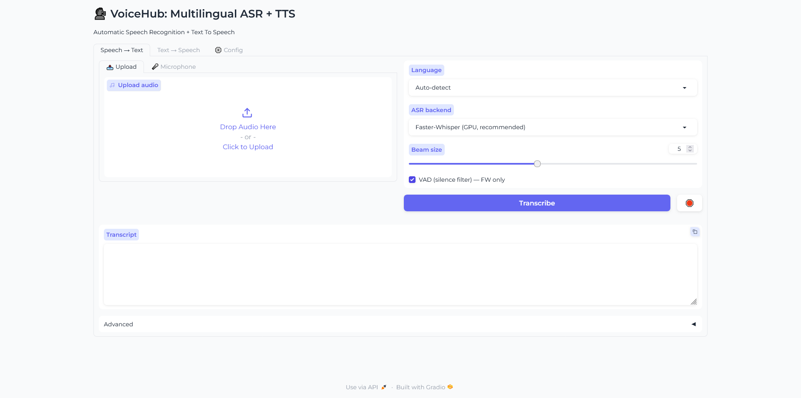
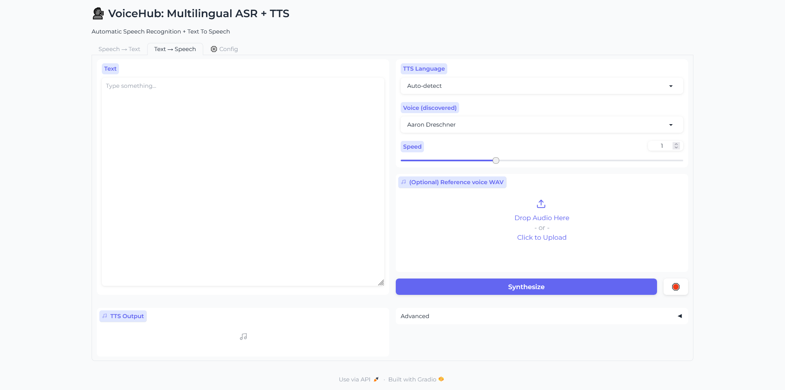
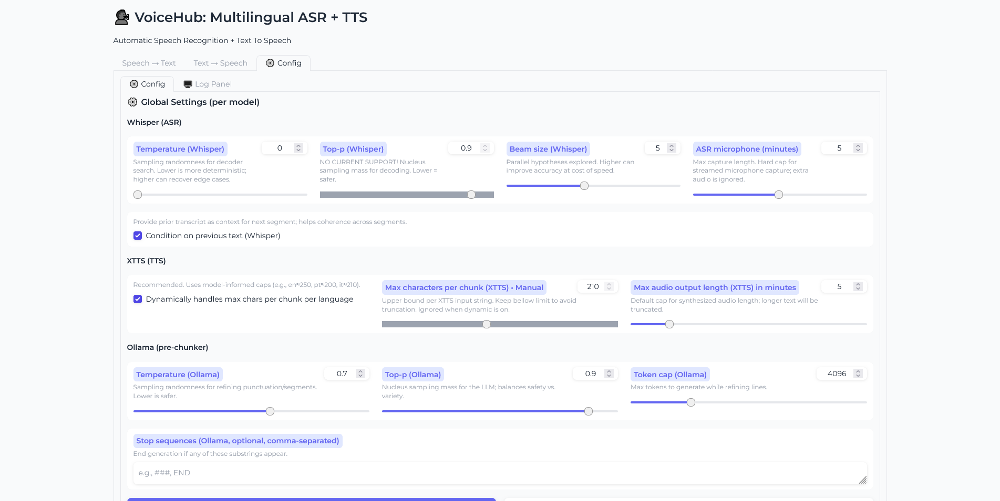
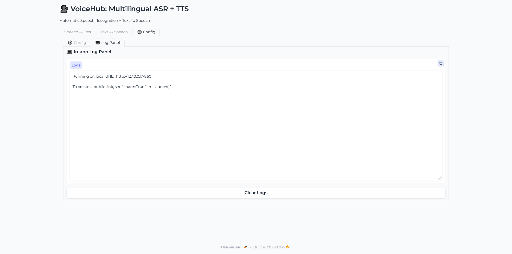

# VoiceHub — Multilingual ASR + TTS (Gradio)

VoiceHub is a local-first speech toolkit that combines **Automatic Speech Recognition (ASR)** and **Text-to-Speech (TTS)** in a clean Gradio app. It supports **file uploads** and **live microphone streaming**, **console-style progress readouts**, an **in-app Log Panel**, and optional **Ollama** integration to pre-chunk and punctuate text for smoother TTS.

---

## Table of contents

- [Features](#features)
- [Requirements](#requirements)
- [Install](#install)
- [Choose your PyTorch (GPU or CPU)](#choose-your-pytorch-gpu-or-cpu)
- [Run](#run)
- [Runtime configuration](#runtime-configuration)
- [How it works](#how-it-works)
- [Configuration & preferences](#configuration--preferences)
- [ASR](#asr)
- [TTS](#tts)
- [Ollama (optional)](#ollama-optional)
- [Logs & debugging](#logs--debugging)
- [Project layout](#project-layout)
- [Environment variables](#environment-variables)
- [Troubleshooting](#troubleshooting)
- [Roadmap / limitations](#roadmap--limitations)
- [Screenshots](#screenshots)
- [Sample audio](#sample-audio)
- [License](#license)
- [Quick start (TL;DR)](#quick-start-tldr)

---

## Features

- **Two-way speech pipeline**
  - **Speech → Text (ASR)** via **Faster-Whisper** (GPU/CPU) with VAD and streaming mic capture; **OpenAI Whisper** as an alternative backend (not fully tested).
  - **Text → Speech (TTS)** via **Coqui XTTS-v2** with speaker discovery, speed control, and optional reference-voice cloning.

- **Preferences stored in-repo:** `preferences/config.json` by default (no hidden OS folders). A legacy `~/.voicehub/config.json` is migrated automatically on first run.

- **Config tab** for per-model defaults (ASR, XTTS, Ollama) with Save and Reset to recommended defaults

- **Log Panel** tab that mirrors stdout/stderr into an in-app textbox

- **Console-style progress bars** (single-line, printed to the log/prompt). We avoid Gradio’s multiple progress widgets to keep the UI clean.

- **Optional Ollama integration**:
  - **Pre-chunker for TTS**: refine punctuation & split long text into TTS-friendly segments.
  - **Translator for ASR**: translate recognized text into another language directly from the ASR tab.
  - UI to refresh models, test connectivity, and **Set as default model**. Public fallback model is **`gemma3:12b`**, and you can persist a different choice.

---

## Requirements

- **Python** 3.10+
- **GPU (optional)** for Faster-Whisper and XTTS-v2 acceleration. CPU should also works (not tested), just slower.
- Dependencies are listed in **`requirements.txt`** and **`environment.yml`**.

---

## Install

### Option A — Conda (recommended)

```bash
# from repository root
conda env create -f environment.yml
conda activate voicehub
```


### Option B — pip / venv

```bash
python -m venv .venv
# Windows: .venv\\Scripts\\activate
source .venv/bin/activate
pip install -r requirements.txt
```

> If `pip install -r requirements.txt` already installed PyTorch successfully, you can skip the next section. If you hit errors with CUDA wheel variants (`+cu121`), install PyTorch explicitly using one of the commands below.

---

## Choose your PyTorch (GPU or CPU)

Install **one** of the following (pick what matches your machine). These commands come straight from the official PyTorch wheel indexes.

### GPU (CUDA 12.1)
```bash
pip install --index-url https://download.pytorch.org/whl/cu121   torch==2.5.1+cu121 torchvision==0.20.1+cu121 torchaudio==2.5.1+cu121
```

### CPU (safe default; works everywhere but slower)
```bash
pip install --index-url https://download.pytorch.org/whl/cpu   torch==2.5.1 torchvision==0.20.1 torchaudio==2.5.1
```

**Notes**
- A GPU running cuda is recommend for a smoother experience (tested with cuda)
- If you’re unsure, use the **CPU** command — the app will run (slower) but reliably.
- **Apple Silicon (M1/M2/M3)**: use the **CPU** wheels — PyTorch will use Metal (MPS) automatically.
- If you previously installed a different Torch in your env, these commands will **reinstall** the specified version.

---

### Run

Either use python app.py or run.sh / run.bat

```bash
python app.py
```

```bash
# windows
run.bat

# linux
run.sh
```
By default the app binds to `127.0.0.1:7870`. You can override with:

```bash
SERVER_NAME=127.0.0.1 SERVER_PORT=7860 python app.py
```
---
## Runtime configuration

VoiceHub can be customized at launch via **environment variables**.  
Set them temporarily in your shell, or permanently in your `run.sh` / `run.bat`.

### Core server settings

- `SERVER_NAME` – interface to bind the Gradio app. Default: `127.0.0.1`  
  (Set to `0.0.0.0` for LAN access.)  
- `SERVER_PORT` – port number. Default: `7870`  
- `MAX_FILE_SIZE` – max file upload size. Default: `300mb`

### Preferences directory

- `VOICEHUB_PREFS_DIR` – folder where preferences (e.g., `config.json`) are stored.  
  Default: `<repo>/preferences/`  

### ASR

- `ASR_BACKEND` – `"fw"` (Faster-Whisper, default) or `"ow"` (OpenAI Whisper)  
- `ASR_VAD_FILTER` – `"1"` to enable voice-activity detection, `"0"` to disable  

### TTS

- `TTS_MODEL` – model path for XTTS-v2 (if you have a custom checkpoint)  
- `TTS_USE_GPU` – `"1"` (default) to prefer GPU; falls back to CPU automatically  

### Ollama

- `OLLAMA_ENABLE` – `"1"` to enable Ollama integration (default `"0"`)  
- `OLLAMA_MODEL` / `OLLAMA_MODEL_DEFAULT` – which Ollama model to use  
- `OLLAMA_HOST` – default `http://127.0.0.1:11434`  
- `OLLAMA_TIMEOUT` – timeout in seconds (default: `30`)  
- `OLLAMA_MAX_SEG_CHARS` – max characters per segment Ollama should return (default: `200`)

### Debug / developer tools

- `DEBUG_TOOLS` – `"1"` to show the **Debug** tab (default hidden)  


### How to set variables

**Linux / macOS (bash):**

```bash
# run with custom port + Ollama enabled
SERVER_PORT=7860 OLLAMA_ENABLE=1 python app.py
```

**Windows (cmd / run.bat):**

```bash
@echo off
set SERVER_PORT=7860
set OLLAMA_ENABLE=1
python app.py
```

**Windows (PowerShell):**

```bash
$env:SERVER_PORT=7860
$env:OLLAMA_ENABLE=1
python app.py
```

---

## How it works

- **Bootstrap** happens in `app.py`. It makes `src/` importable, points **preferences** to `<repo>/preferences`, queues Gradio for streaming events, increases max upload size, and mutes specific non-critical errors/warnings.
- **UI** lives in `src/voicehub/ui.py`: builds tabs, wires buttons, and manages component state. Mic streaming uses `Audio.start_recording/stream/stop_recording`.
- **Preferences** are JSON in `preferences/config.json` (migrated from `~/.voicehub/config.json` if present).
- **User settings** (beam size, XTTS chunk caps, mic hard cap, etc.) are centralized and persisted via the **Config** tab.
- **Log Panel** tees stdout/stderr so you can glance at everything from inside the UI.

---

## Configuration & preferences

### Where are my settings?

- Stored under **`preferences/config.json`** (created on first run). You can relocate with the `VOICEHUB_PREFS_DIR` env var, but by default we keep it **inside the repo** for easy discovery.

### Config tab

Update global defaults for:

- **Whisper (ASR):** temperature, beam size, condition on previous text, microphone stream hard cap.
- **XTTS (TTS):** dynamic per-language max chars per chunk, manual caps, and default max output minutes. **Reset** returns sliders/toggles to recommended defaults.
- **Ollama (optional):** temperature, top-p, token cap, optional stop sequences.

---

## ASR

- **Backends:**
  - **Faster-Whisper (recommended):** GPU-accelerated; supports **STOP** and **console progress**. VAD toggle available.
  - **OpenAI Whisper:** functional; **STOP** is not supported (UI warns if you try).
- **Mic streaming:** the browser streams chunks; we buffer and enforce a hard cap by **minutes** (configurable), trimming the last chunk precisely when the cap is hit. On stop, we save one WAV for preview and run the normal transcription path.
- **Upload mode:** provide a WAV; hit **Transcribe**.
- **Translate (optional):** use **Ollama** to translate the transcript to another language from the **ASR Advanced** accordion. Includes **Refresh models** and **Test Ollama**.
- **ASR STOP button:** ends Faster-Whisper decoding mid-way and returns partial text + a status message in the **ASR meta** box.

---

## TTS

- **Engine:** **Coqui XTTS-v2** (auto GPU if available, otherwise CPU). Speakers are discovered dynamically from the model.
- **Language & voice:** choose TTS language, pick a discovered voice, adjust speed, and optionally provide a **reference WAV** to bias accent/style.
- **Chunking:** we split on sentence boundaries and assemble max-length chunks; optional **Ollama pre-chunker** can refine punctuation & line breaks first. Progress is printed line-by-line; output audio is concatenated. **STOP** halts further chunk dispatch and posts a status.
- **Warnings:** if XTTS can’t move to GPU, we fall back to CPU and continue.

---

## Ollama (optional)

- Enable from **TTS › Advanced** (and in **ASR › Advanced** for translation). You can **Refresh models**, **Test Ollama**, and **Set as default model** from the UI.
- **Default model precedence:**
  1) Saved user preference (`ollama_model_default`) if present
  2) `OLLAMA_MODEL` or `OLLAMA_MODEL_DEFAULT` env vars
  3) Public fallback **`gemma3:12b`**
- **Pre-chunk prompt:** optimizes punctuation, splits to ≤ `max_chars`, avoids comma-splices, keeps meaning, and outputs one segment per line.

---

## Logs & debugging

- **Log Panel** tab mirrors the real console; auto-refreshes every 0.5s; includes **Clear logs**.
- **Debug (dev) tab** (hidden unless `DEBUG_TOOLS=1`): inspect the **full TTS chunking pipeline** — raw → (optional Ollama) refined → sentences → chunks — plus language detection output. Includes **Test Ollama**.

---

## Project layout

```
.
├─ app.py                    # entrypoint; preferences path; Gradio launch; startup filters
├─ run.sh / run.bat          # convenience launchers
├─ requirements.txt / environment.yml
├─ data/                     # some example samples
├─ docs/                     # some example screenshots
├─ preferences/              # created on first run; stores config.json
└─ src/voicehub/
   ├─ ui.py                  # UI, tabs, wiring, STOP buttons, mic streaming
   ├─ asr.py                 # Faster-Whisper / Whisper backends; stream buffer & hard cap
   ├─ tts.py                 # XTTS-v2 synth; chunking; progress; STOP
   ├─ config.py              # language lists, model names, backends & defaults
   ├─ config_ui.py           # Config tab (save/reset)
   ├─ user_settings.py       # persisted defaults (per model)
   ├─ ollama_config.py       # Ollama defaults + preference helpers
   ├─ ollama_utils.py        # list models, test link, refine/translate
   ├─ progress_utils.py      # console-style progress helpers
   ├─ log_panel.py           # in-app log tee with Clear
   ├─ debug_ui.py            # developer pipeline inspector
   ├─ lang_detect.py         # TTS language auto-detect helper
   └─ __init__.py
```

---

## Environment variables

Useful knobs when launching:

- **Server:** `SERVER_NAME` (default `127.0.0.1`), `SERVER_PORT` (default `7870`).
- **Uploads:** `MAX_FILE_SIZE` (e.g., `300mb`).
- **Preferences dir:** `VOICEHUB_PREFS_DIR` (defaults to `<repo>/preferences`).
- **Ollama:** `OLLAMA_ENABLE`, `OLLAMA_MODEL` / `OLLAMA_MODEL_DEFAULT`, `OLLAMA_HOST`, `OLLAMA_TIMEOUT`, `OLLAMA_MAX_SEG_CHARS`.
- **Debug tab:** `DEBUG_TOOLS=1` to show the developer tab.

---

## Troubleshooting

- **Content-Length errors in the console:** benign h11 protocol noise (“too much/little data for declared Content-Length”); muted by default.
- **Deprecation warning about `pkg_resources` (ctranslate2):** suppressed on startup.
- **XTTS won’t use GPU:** we try GPU first; on failure we **fall back to CPU**.
- **ASR mic recording stops early:** increase **“ASR microphone (minutes)”** in **Config**. A hard cap is enforced; the last chunk is trimmed to fit.
- **STOP doesn’t work on OpenAI Whisper:** not supported; the UI warns when you try. Use **Faster-Whisper** for STOP/progress.

---

## Roadmap / limitations

- **ASR STOP:** implemented for **Faster-Whisper** only; OW remains best-effort.
- **Progress bars:** console-style only (by design) to avoid UI clutter.
- **Chunking:** default is sentence-first assembly with max-char caps; Ollama pre-chunker is optional and tunable.

---

## Screenshots

### ASR (Speech → Text)


### TTS (Text → Speech)


### Config


### Log Panel


---

## Sample audio

- Download: [sample_audio_1.wav](data/samples/sample_audio_1.wav)
- Download: [sample_audio_2.wav](data/samples/sample_audio_2.wav)
- Text:     [sample_text.txt](data/samples/sample_text.txt)

---

## License

This project is licensed under the [MIT License](https://mit-license.org/).

---

## Quick start (TL;DR)

```bash
conda env create -f environment.yml
conda activate voicehub
run.bat
# open http://127.0.0.1:7870
```


- **TTS:** paste text → pick language/voice → **Synthesize** → (optional) use **Ollama pre-chunker** → **STOP** if needed.
- **ASR:** upload WAV or use **Microphone** → **Transcribe** → **STOP** (Faster-Whisper only) → (optional) **Translate** via Ollama.


